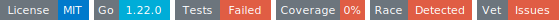

# tinywodp
<!-- START_SECTION:BADGES_SECTION -->

<!-- END_SECTION:BADGES_SECTION -->

Lightweight Go library for JSON handling and HTML form generation in WebAssembly with TinyGo: tag‑based validation, reflectlite and metadata caching.
